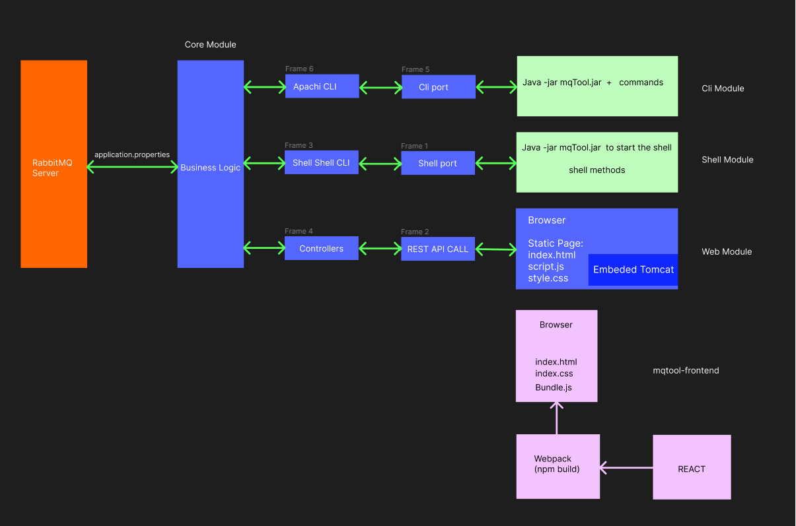

## RabbitMQ Tool
This is a tool designed to perform customized activities on RabbitMQ Messaging Service. 
Project RabbitMQ Tool has Three accessing application ports, built with Apache CLI, Shell CLI and Web UI.
Project Structure consists Five Directories for Four modules of this loosely coupled application architecture.
1. core
2. shell
3. cli
4. web
5. mqtool-frontned

### Installation
#### 1. Download [RabbitMQ](https://www.rabbitmq.com/) (refer the steps from document in [Teams](https://ts.accenture.com/:w:/r/sites/PracticeProjectMobileAppShoppingList/Shared%20Documents/General/RabbitMQTool%20Documents/How%20to%20install%20RabbitMQ.docx?d=wdf9d289607a64f7cbe2c4244b78405bd&csf=1&web=1&e=Djh1Px))
To access default rabbitMQ http://localhost:15672/

    user: guest
    password: guest

#### 2. application.properties configuration
Setup application.properties in core directory. 
Below is the default properties example:

    spring.rabbitmq.username=guest
    spring.rabbitmq.password=guest
    spring.rabbitmq.host=localhost
    spring.rabbitmq.port=5672
    spring.rabbitmq.api.port=15672

#### 3. Download the private and public keys 
Download from [here](https://ts.accenture.com/:f:/r/sites/PracticeProjectMobileAppShoppingList/Shared%20Documents/General/RabbitMQTool%20Documents/keys?csf=1&web=1&e=mFnjBP) and place it along with the application.properties file in core directory.

#### 4. Dependencies - Maven clean and install
pom.xml for parent has springframework.boot as super parent, which handles most of the dependencies. Child module dependencies are with placed with respective child modules.  
Version control are managed within dependency management in parent pom.

#### 5. Running project 
Navigate to the target folder where are jar are created for Shell/Cli/Web modules.

	java -jar <module_name-1.0.0-SNAPSHOT>.jar

Read more details on respective module README.md
# mqtoolRep
