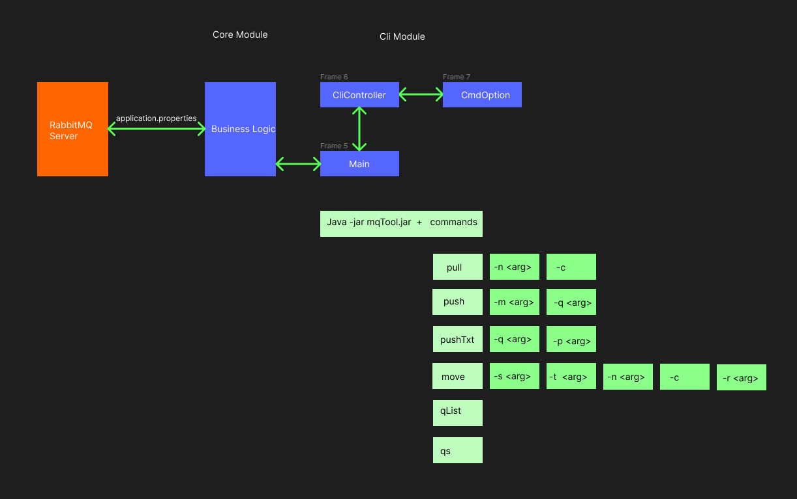

## CLI module is a Apache CLI RabbitMQ tool

### Flow Chart
1. The flow of the commands can be viewed/edited [here](https://www.figma.com/file/MFg3ctQZfUSVp46XQnCBAI/RabbitMQ-Apache-CLI?type=design&node-id=0-1&mode=design&t=xqvB5w66DaNykBGl-0).

### Downloading dependencies
1. Run Maven clean and install from lifecycle of core module
2. Run Maven clean and install from lifecycle of cli module

### Building jar file of mqTool Apache Cli application
1. Build the project by running the Maven Build
2. Once all the dependencies are downloaded, check for project built target folder
3. Target folder will have the cli-1.0.0-SNAPSHOT.jar
4. Use any Commandline to run the application jar file 'java -jar cli-1.0.0-SNAPSHOT.jar' with commands arguments
5. Once jar and the program command is executed the Process will exit with code 0
6. To list the all the program commands available, run 'java -jar cli-1.0.0-SNAPSHOT.jar help'

### Local setup of mqTool Shell Cli application
1. Once all the dependencies are downloaded locate the src main method in cli module directory
2. Run the application main method from 'Main.java' class with Program Arguments
3. To enter your arguments - Open Edit/Modify Configurations 
4. In Intellij IDE it will open Run/Debug window, where you can enter Program Arguments
5. To list the all available commands, enter 'java -jar cli-1.0.0-SNAPSHOT.jar help' in Program Arguments and run the application

### How to debug project locally
1. Main.java class has switch cases for the Arguments list
2. CmdOption.java class has list of Options for the commands
3. CliController.java calls core business logics to pass the command options
4. To debug make sure you have the complete mqtool parent in the same project in your IDE

### application properties?? (tbd)