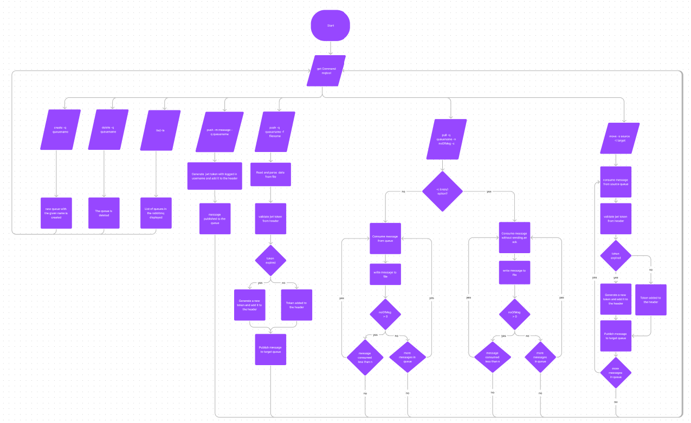

## Shell module is a Shell CLI RabbitMQ tool

### Flow Chart
1. The flow of the commands can be viewed Rabbitmq Shell CLI tool Flow diagram.pdf or in PP Teams Channel [here](https://ts.accenture.com/:b:/r/sites/PracticeProjectMobileAppShoppingList/Shared%20Documents/General/RabbitMQTool%20Documents/Rabbitmq%20command%20line%20tool%20Flow%20diagram.pdf?csf=1&web=1&e=LcAAdT).
2. To edit and corrections you can visit [here](https://www.figma.com/file/4hjbjidjTTFwqqpVH65mK6/Rabbitmq-command-line-tool-Flow-diagram?type=whiteboard&t=v3eZzM1JEsD8LUFN-0).

### Downloading dependencies
1. Run Maven clean and install from lifecycle of core module
2. Run Maven clean and install from lifecycle of shell module

### Building jar file of mqTool Shell Cli application
1. Build the project by running the Maven Build
2. Once all the dependencies are downloaded , check for project built target folder
3. Target folder will have the shell-1.0.0-SNAPSHOT.jar
4. Use any Commandline to run the application jar file 'java -jar shell-1.0.0-SNAPSHOT.jar'
5. Once the 'shell:>' prompt is open run 'help' to get all available commands

### Local setup of mqTool Shell Cli application
1. Once all the dependencies are downloaded locate the src main method in shell module directory
2. Run the Springboot application main method from 'MqShellApp.java' class 
3. Once the application starts running 'shell:>' prompt will open
4. Once the 'shell:>' prompt is open run 'help' to get all available commands

### How to debug project locally
1. MqShellAppConfig from config package has configuration to core module service business logics
2. RabbitMqCommandsController is a shellComponent which has the shell methods and shell options
3. To debug make sure you have the complete mqtool parent in the same project in your IDE

### application properties?? (tbd)