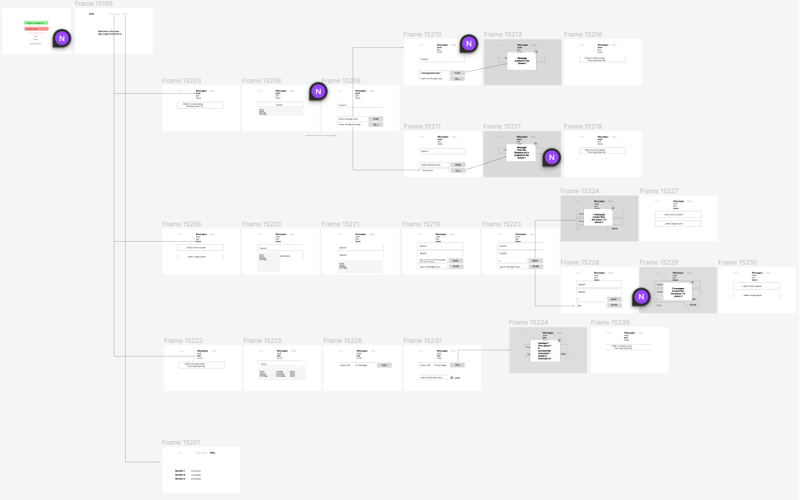

## Web module is a Webpage UI of RabbitMQ tool

### Flow Chart
1. The prototype of the web application is [here](https://www.figma.com/file/CDcqn0wNXUCX0klF6UGiye/MQTOOL?type=design&mode=design&t=v3eZzM1JEsD8LUFN-0).

### Local setup of mqTool Web Front end application
1. Run Maven clean and install from lifecycle of web module and core module
2. Build the project by running the main application or by Maven Build

### Build plugins details
1. There are two plugins are used with spring-boot-maven-plugin to build the web project using mqtool-frontend, which is a React Typescript Project
2. 'frontend-maven-plugin' will run the 'npm install' to install all node-modules and builds resources to be used in the Web module
3. 'maven-resources-plugin' will copy the built resources from mqtool-frontend and packages to Web module static output resources directory

### Starting the jar application
1. Once all the dependencies are downloaded and project is built target directory will be built
2. Target folder will have the web-1.0.0-SNAPSHOT.jar
3. Use any Commandline to run the application jar file 'java -jar web-1.0.0-SNAPSHOT.jar'
4. Embedded Tomcat will start the server, which can be accessed at default localhost:8080 or configured port from browser

### Starting the local application through IDE
1. Once all the dependencies are downloaded locate the src main method in web module directory
2. Run the Springboot application main method from 'WebApplication.java' class
3. Default port is localhost:8080

### How to debug project locally
1. WebAppConfig from config package has configuration to core module service business logics
2. 'controller' package has the related RestControllers for the mapping
3. To debug make sure you have the complete mqtool parent in the same project in your IDE

### application properties?? (tbd)
1. To configure non-default port, update the application.properties of web module